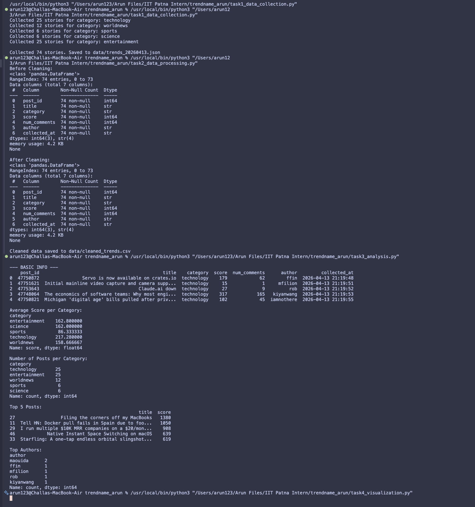
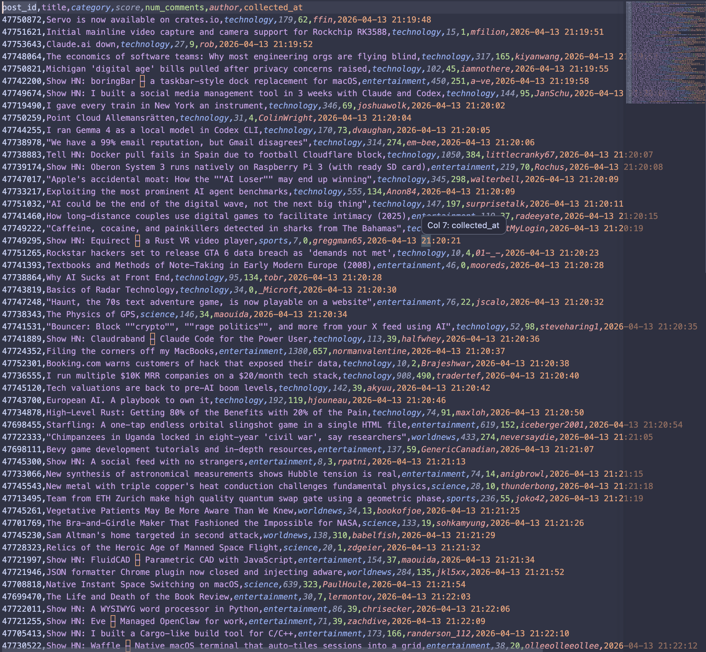
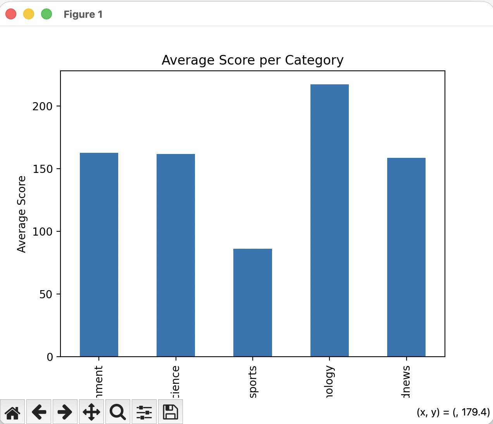
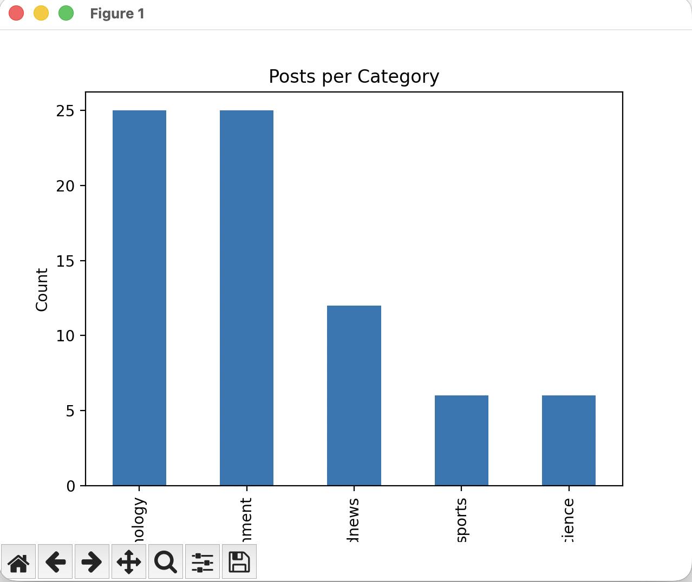
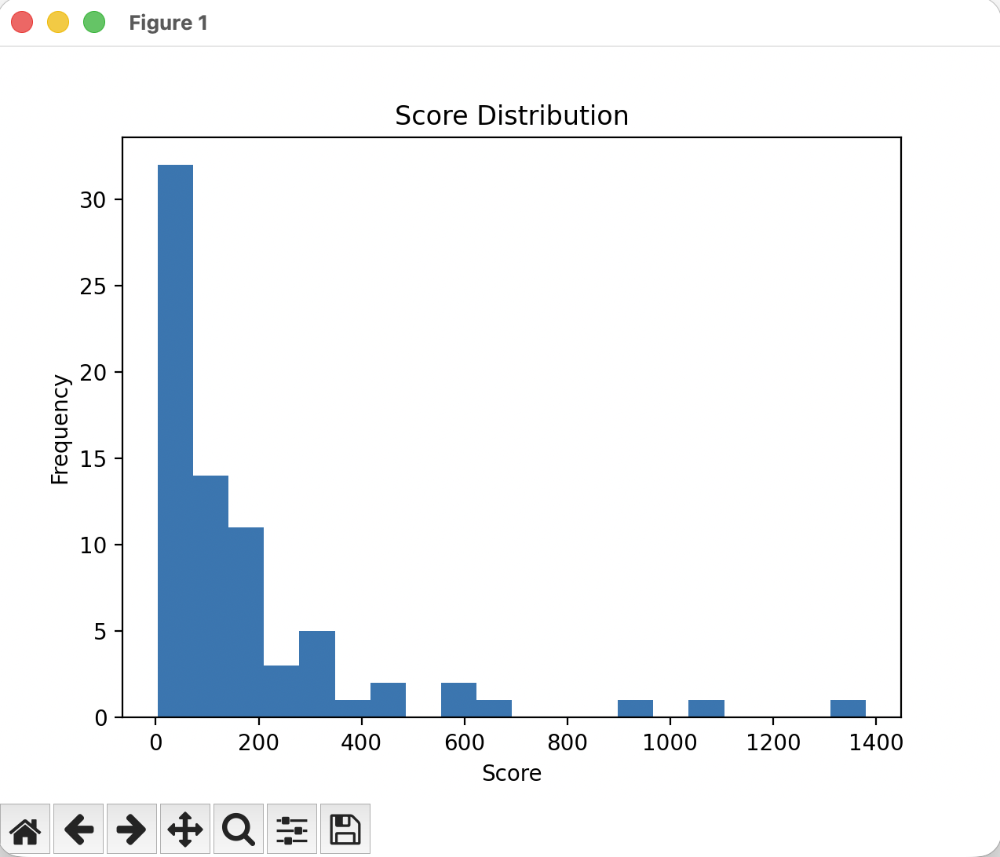

# TrendPulse 📊

A simple data pipeline project that fetches real-time trending stories from HackerNews, processes the data, analyzes it, and visualizes insights.

---

## 🚀 Project Overview

TrendPulse is built as a 4-step pipeline:

1. **Data Collection**
   - Fetch top stories from HackerNews API
   - Categorize into:
     - Technology
     - World News
     - Sports
     - Science
     - Entertainment

2. **Data Processing**
   - Clean missing values
   - Remove duplicates
   - Convert JSON → CSV

3. **Data Analysis**
   - Average score per category
   - Top posts
   - Most active authors

4. **Visualization**
   - Bar charts
   - Histogram of scores

---

## 📂 Project Structure

```
trendpulse-yourname/
│
├── task1_data_collection.py
├── task2_data_processing.py
├── task3_analysis.py
├── task4_visualization.py
│
├── data/
│   ├── trends_YYYYMMDD.json
│   └── cleaned_trends.csv
│
├── images/
│   ├── output.png
│   ├── csv.png
│   ├── analysis.png
│   ├── bar_chart.png
│   └── histogram.png
│
└── README.md
```
---

## 📊 Output

- JSON file with collected data  
- Cleaned CSV file  
- Console-based analysis  
- Graphical visualizations  

---

## 📸 Screenshots

### 🔹 Program output



---

### 🔹 Cleaned CSV Preview



---

### 🔹 Visualization outputs









---

## 💡 Key Learnings

- Working with APIs  
- Data cleaning using Pandas  
- Data analysis techniques  
- Data visualization with Matplotlib  

---

## ✅ Final Output

- ✔ 100+ stories collected  
- ✔ Clean dataset generated  
- ✔ Insights extracted  
- ✔ Visualizations created  
